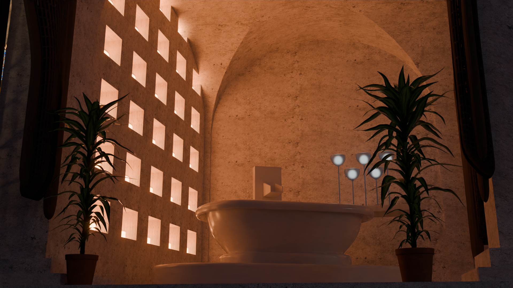
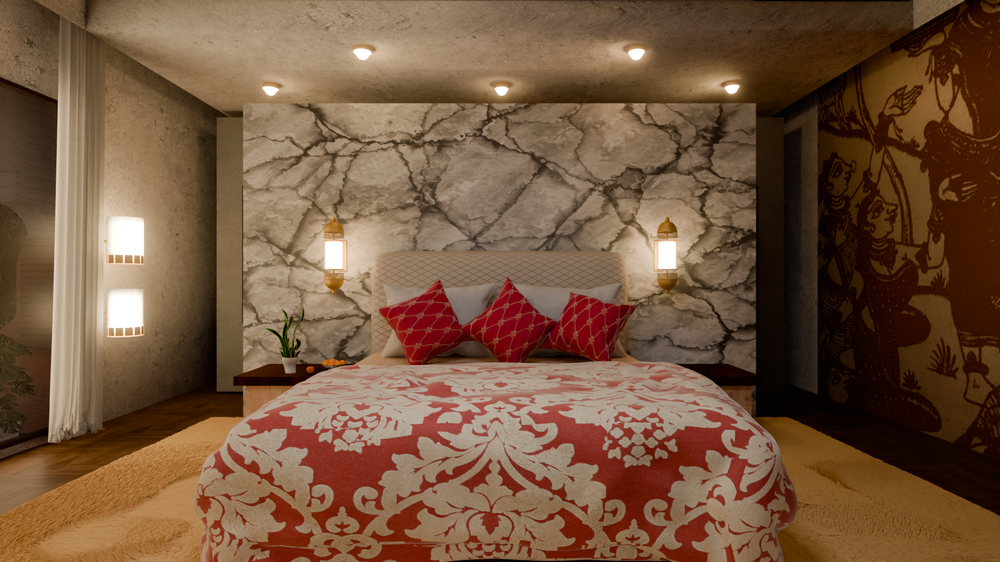
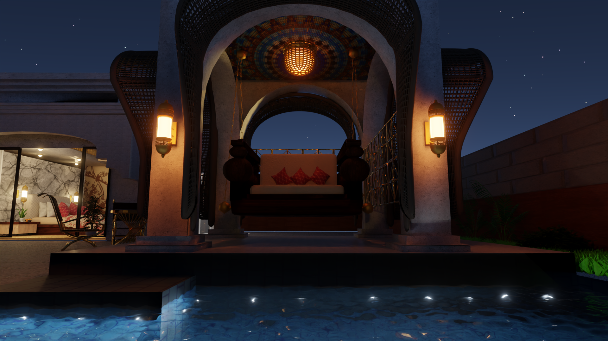

A Photorealistic render of [Taj Bekal Resort & Spa](https://www.tajhotels.com/en-in/hotels/taj-bekal-kerala), Kerala created in Blender
<!--more-->

My artwork is a photorealistic 3D render of the Taj Bekal Resort & Spa, Kerala, created using Blender. Inspired by the unique architecture of the hotel, which features the traditional Kettuvallam boat houses with the Chitra Pothi art form, I decided to recreate it in 3D. 

